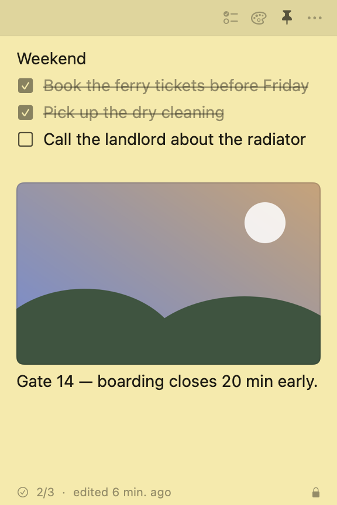

# Stick Pad

Encrypted sticky notes for the Mac. Notes float above whatever app you're in,
hold checklists, and live on disk as a single AES-256-GCM encrypted file that
only your Mac holds the key to.



## Build and run

```bash
./build.sh --run
```

That compiles the app, renders the icon, packages `build/Stick Pad.app` and
launches it. Other modes:

| Command | What it does |
| --- | --- |
| `./build.sh` | Build the `.app` only |
| `./build.sh --run` | Build, then launch |
| `./build.sh --install` | Build, copy into `/Applications`, launch |
| `./build.sh --test` | Run the test suite |

Requires macOS 14+ and the Xcode Command Line Tools (`xcode-select --install`).
Full Xcode is not needed.

## Using it

A note is a stack of lines. Each line is either plain text or a checklist item,
and lines wrap rather than scrolling sideways.

- **Return** starts a new line. On a checklist item it starts another checklist
  item; on an *empty* checklist item it ends the list.
- **Backspace** at the start of a line removes its checkbox first, then merges
  the line into the one above.
- **Up/Down arrows** move between lines once the caret reaches the end of the
  one it's on.
- Click the empty space below the last line to keep writing.
- Paste multi-line text and it splits into separate lines.
- **Drag an image onto a note**, paste one with `⌘V`, or use `⌘I` to pick files.
  Hover an image to get the × that removes it, or press Backspace at the start
  of the line below it.

The header buttons — visible on hover, faint otherwise — toggle a checkbox,
open the colour palette, pin the note, and open the rest of the options. The
red close button hides a note; deleting is separate and always asks first.

### Keyboard

| Shortcut | Action |
| --- | --- |
| `⌘N` | New note |
| `⌘S` | Save the front note as a file |
| `⇧⌘S` | Save all notes to a folder |
| `⌘W` | Close the front note (it isn't deleted) |
| `⌘I` | Add an image |
| `⌘L` | Toggle a checkbox on the current line |
| `⌘K` | Next colour |
| `⌘T` | Keep on top, on or off |
| `⌘R` | Reset to 4 × 6 inches |
| `⌘⌫` | Delete the front note (asks first) |
| `⌘0` | All Notes |

### Always on top

Notes open as non-activating floating panels. Three things follow from that:

- They stay above other apps' windows when you switch away.
- Clicking into a note lets you type in it **without** pulling Stick Pad
  forward, so the app you were in stays frontmost.
- They're visible on every Space and over full-screen apps.

`⌘T` (or the pin button) drops an individual note back to the normal window
level when you'd rather it behaved like an ordinary window.

### Size

A note opens at 288 × 432 points. macOS lays out at exactly 72 points per inch,
so that is a true 4 × 6 inches on screen at any display scaling. Notes are
resizable; `⌘R` puts one back to 4 × 6.

### Closing vs deleting

Closing a note (red button or `⌘W`) puts it away and remembers it was closed.
Nothing is lost — reopen it from **All Notes** (`⌘0`) or the menu bar icon.
Deleting is permanent and always confirms first.

Closing every note doesn't quit the app; it stays in the menu bar. Quit with
`⌘Q`.

## Images

Drop an image onto a note, paste one, or pick files with `⌘I`. Images sit
inline as their own rows, scaled to the note's width and capped in height so
one picture can't swallow a 4 × 6 inch note.

**Images are encrypted the same way your text is.** Each one is sealed
individually with AES-256-GCM under the same key and written to:

```
~/Library/Application Support/StickPad/Attachments/<id>.spadimg
```

They deliberately do *not* live inside `notes.spad`. That file is rewritten on a
debounce every time you type, and re-encrypting several megabytes of photos on
every keystroke would make typing crawl. An attachment is written once and then
only read. Files nothing refers to any more are deleted — when you remove an
image, delete a note, or next time the app starts.

On the way in, an image is rotated upright from its EXIF orientation and
downsampled so its longest edge is at most 2048 pixels. Pictures with
transparency are kept as PNG; everything else becomes JPEG, which is
dramatically smaller for photographs. Anything above 60 MB is refused.

## Saving notes as files

Notes save themselves into the encrypted store as you type — there is no "save"
step to remember. Saving to a *file* is a separate thing: getting a copy out to
somewhere you choose.

| Menu | What it writes |
| --- | --- |
| **File ▸ Save Note As…** (`⌘S`) | The front note, as Markdown or plain text |
| **File ▸ Save All Notes to a Folder…** (`⇧⌘S`) | Every note, one Markdown file each |
| **Security ▸ Save Encrypted Backup…** | Every note *and image*, still encrypted |

Checklists survive the trip. Markdown uses task-list syntax, which most editors
render as real checkboxes:

```markdown
Weekend
- [x] Book the ferry tickets before Friday
- [ ] Call the landlord about the radiator
```

Plain text uses `[x]` / `[ ]` instead.

Images come along too. Saving a single note writes its pictures into a
`<note name> images/` folder beside the file; a folder export puts them all in
one shared `images/` directory, so an image used by two notes is written once.
The exported Markdown links to them, so it renders with the pictures in place.

**Saving to Markdown or text writes readable, unencrypted files.** That's the
point of the feature — the file needs to be usable in other apps — but it does
mean the copy is no longer protected by anything except the folder you put it
in. The save panel says so each time. If you want a copy that stays protected,
use the encrypted backup instead.

Filenames come from each note's first line, cleaned up so they're legal and
visible: `Trip / Notes: 2026` becomes `Trip Notes 2026.md`. "Save all" writes
into a new `Stick Pad Notes` folder every time, so it can never overwrite
anything already sitting there, and notes that share a title get distinct names.

### Backing up and restoring

**Security ▸ Save Encrypted Backup…** seals every note *and every image* into a
single portable file, still encrypted, wherever you like — a USB stick, an external drive, a cloud folder.
**Restore from Encrypted Backup…** puts one back.

Restoring replaces everything currently in Stick Pad, so it confirms first, and
the notes being replaced are kept next to the store as `notes.spad.bak`. A
backup written on a different Mac is checked *before* anything is replaced: if
your key can't open it you get told to import the matching key first, rather
than ending up with notes you can't read. Backups made before images existed
still restore.

## Encryption

Every note lives in one file, sealed with **AES-256-GCM**:

```
~/Library/Application Support/StickPad/notes.spad
```

- The 256-bit key is generated on first launch and stored in your **login
  Keychain**, marked `WhenUnlockedThisDeviceOnly` — it isn't readable while the
  Mac is locked and isn't swept into an iCloud Keychain backup.
- The store file is written `0600` (owner read/write only) and atomically, with
  one previous generation kept as `notes.spad.bak`.
- Every write uses a fresh random nonce, and the GCM tag authenticates the file
  header as well as the contents, so a tampered store fails to open rather than
  quietly returning altered notes.
- Plaintext exists only in memory. No text, and not even JSON keys, appear in
  the file — there's a test that asserts exactly that.
- Nothing is uploaded anywhere. There is no server and no network code.

If the store can't be decrypted, Stick Pad **stops saving** and says so, rather
than overwriting a store whose key you might still recover.

### Using the same notes on a second Mac

This is what makes it end-to-end rather than just encrypted-at-rest: put
`notes.spad` in a synced folder (iCloud Drive, Dropbox, a USB stick) and move
the key across by hand.

1. **Security ▸ Export Encryption Key…** on the first Mac, and keep the key in a
   password manager.
2. **Security ▸ Import Encryption Key…** on the second.

The sync provider only ever holds ciphertext. Only machines holding the key can
read it.

> Sync is deliberately unmanaged: Stick Pad doesn't merge concurrent edits, so
> two Macs writing the same store at once will have one overwrite the other.
> It's designed for moving notes between machines, not for simultaneous use.

### What this does and doesn't protect against

Protected: someone with your powered-off Mac, a copy of the file from a backup
or sync folder, or another app reading the store directly.

Not protected: anything running as you while you're logged in — Stick Pad
decrypts into memory to show your notes, and so could malware with your
privileges. Full-disk encryption and a locked screen still matter.

## Testing

```bash
./build.sh --test
```

153 checks covering the crypto (round trips, wrong keys, tampered ciphertext and
headers, nonce reuse), the encrypted store (opacity on disk, file permissions,
backups, key mismatches), the editing model (Return/Backspace semantics,
checkboxes, paste splitting, navigation), images (downsampling, sealed
attachment files, orphan cleanup, decoding notes written before images existed),
saving to files (Markdown and text rendering, image folders, filename
sanitising, collision handling, backup and restore) and real AppKit window
behaviour (floating level, 4 × 6 size, non-activating focus, Spaces).

XCTest ships with Xcode, and this project builds with the Command Line Tools
alone, so the suite runs as a plain executable (`Sources/StickPadTests`) with a
small assertion harness. If you install Xcode later, the code is already split
into a `StickPadKit` library so an XCTest target can drop straight in.

## Layout

```
Sources/
  StickPadKit/          Everything: models, encrypted store, UI
    Model/              Note, lines, colours, geometry, editing model
    Store/              KeyStore (Keychain), CryptoBox (AES-GCM), SecureStore,
                        AttachmentStore (sealed images), BackupArchive,
                        NoteStore, NoteExporter (saving to files)
    UI/                 Note panel, note view, line editor, notes list, menus
    AppDelegate.swift   Lifecycle, windows, key import/export
  StickPad/             The app executable (a three-line shim)
  StickPadTests/        Test runner and harness
Tools/makeicon.swift    Draws the app icon
build.sh                Build, package, sign, install, test
```

`Sources/StickPadKit/UI/LineEditor.swift` is the least obvious part: each line
is an `NSTextView` on an explicit TextKit 1 stack, which is what makes
caret-aware arrow navigation between lines and per-line height measurement
possible. SwiftUI's `TextField` can't wrap, and a single `TextEditor` can't give
individual lines their own checkboxes.

## Two things to know

**A Keychain prompt after rebuilding.** The app is ad-hoc signed, so its code
signature changes every time you rebuild. The Keychain ties the key to the
signature, so the first launch after a rebuild asks for permission once — click
**Always Allow**. Day-to-day use never asks. (Stick Pad reads the Keychain off
the main thread, so if the prompt does appear you get an "Unlocking your notes"
card rather than a frozen window.)

**Gatekeeper.** The app isn't notarised, because it's built locally by you. If
macOS ever refuses to open it, right-click the app and choose **Open**.

## Development helper

```bash
"build/Stick Pad.app/Contents/MacOS/StickPad" --render-preview ./out
```

Renders sample notes to PNG in light and dark appearance without opening a
window — handy for checking the design.
